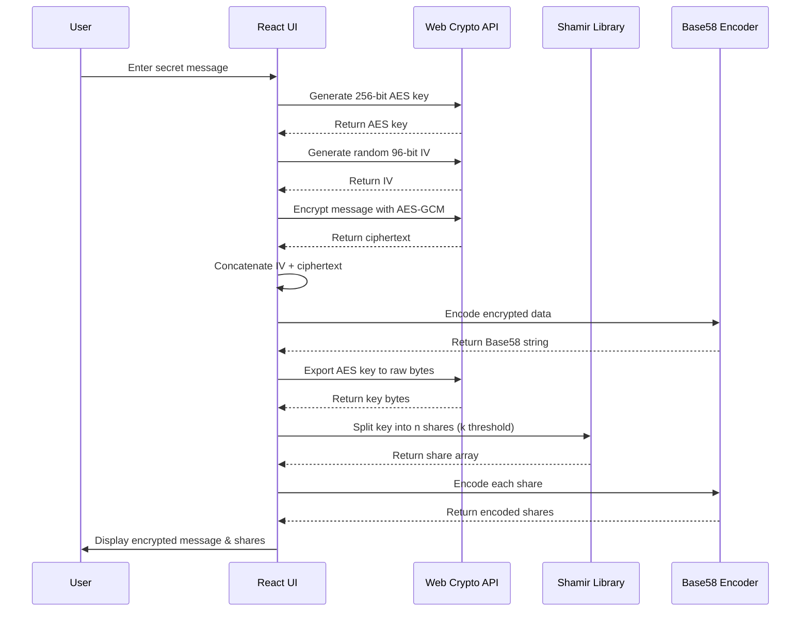
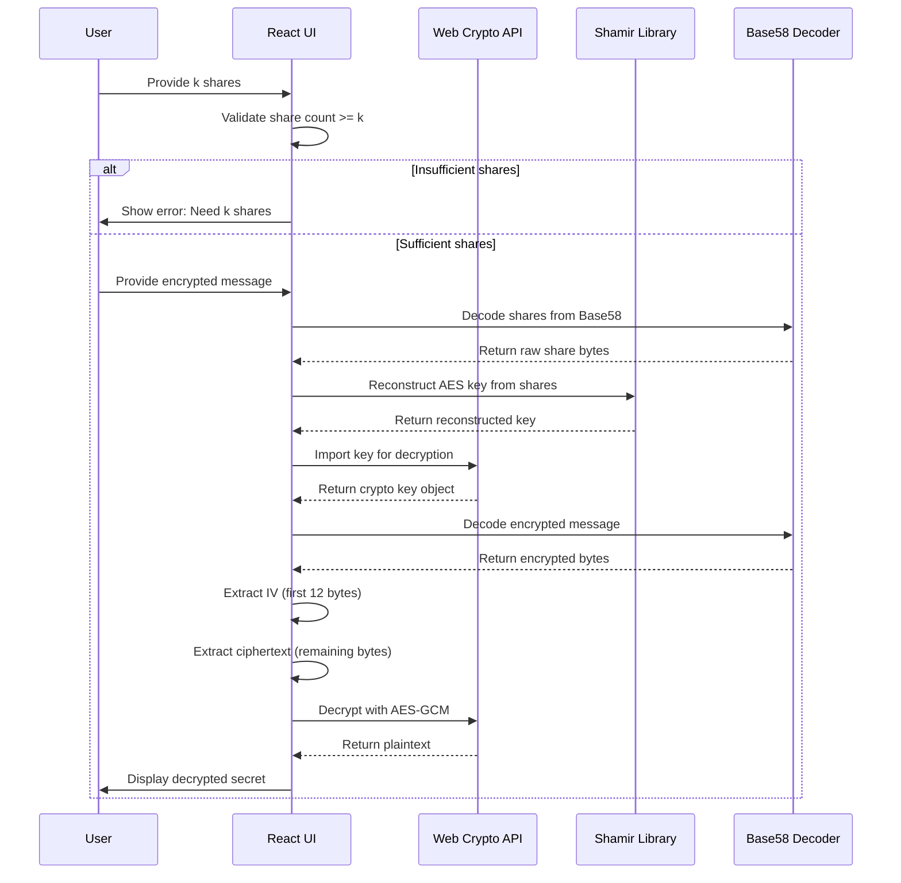

# Shared Secret Encrypt

This is a simple web application that allows users to encrypt and decrypt messages using a shared secret key. The idea is to provide a secure way to share sensitive information with trusted parties where only if particular threshold of the parties collaborate, the message can be decrypted.

One such use case is sharing sensitive information (like passwords or financial details) after someone's death, where multiple trusted parties (like family members or lawyers) need to collaborate to access the information. Think of this as a digital will that can only be opened when a certain number of trusted individuals agree to do so. **For the time being this is a toy project and should not be used for real-world applications.**

## Implementation Details

This application implements a secure secret sharing system using **Shamir's Secret Sharing** algorithm combined with **AES-GCM encryption**. The implementation provides both cryptographic security and usability through a modern React-based interface.

### Core Technologies

- **Frontend Framework**: React with TypeScript
- **Cryptography**:
  - Web Crypto API for AES-GCM encryption
  - Web Crypto API for secure ephemeral key generation
  - `shamir-secret-sharing` library for threshold cryptography
  - `bs58` for Base58 encoding (Bitcoin-style encoding)

### Cryptographic Architecture

#### 1. Secret Encryption Process

1. **Key Generation**: A 256-bit AES key is generated using `crypto.subtle.generateKey()`
2. **Message Encryption**: The secret message is encrypted using AES-GCM with a random 96-bit IV
3. **Data Packaging**: The IV and ciphertext are concatenated and encoded with Base58
4. **Key Splitting**: The AES key is split into _n_ shares using Shamir's Secret Sharing, where any _k_ shares can reconstruct the original key


#### 2. Secret Decryption Process

1. **Share Collection**: Users provide at least _k_ valid shares (where _k_ is the threshold)
2. **Key Reconstruction**: Shamir's algorithm combines the shares to reconstruct the original AES key
3. **Key Import**: The reconstructed key is imported back into the Web Crypto API
4. **Message Decryption**: The encrypted message is decrypted using the reconstructed key and extracted IV


### Process Flow Diagrams

#### Encryption Sequence



#### Decryption Sequence



### Security Features

- **AES-GCM Encryption**: Provides both confidentiality and authenticity
- **Threshold Cryptography**: Prevents single points of failure - requires collaboration
- **Secure Random Generation**: Uses cryptographically secure random number generation
- **Memory Safety**: Leverages browser's native crypto implementations
- **No Key Storage**: Keys exist only temporarily during encryption/decryption operations

### Configuration Options

- **Shares Count** (_n_): Total number of shares to generate (default: 3)
- **Shares Threshold** (_k_): Minimum number of shares needed for decryption (default: 2)

### Encoding and Transport

All cryptographic outputs are encoded using Base58, which:

- Avoids similar-looking characters (0, O, I, l)
- Is URL-safe and copy-paste friendly
- Is commonly used in cryptocurrency applications
- Provides good data density compared to Base64

### Browser Compatibility

The application requires modern browsers that support:

- Web Crypto API (`crypto.subtle`)
- ES6+ JavaScript features
- React 19 features

## Development

To install dependencies:

```bash
bun install
```

To start a development server:

```bash
bun dev
```

To run for production:

```bash
bun start
```

This project was created using `bun init` in bun v1.2.18. [Bun](https://bun.sh) is a fast all-in-one JavaScript runtime.
