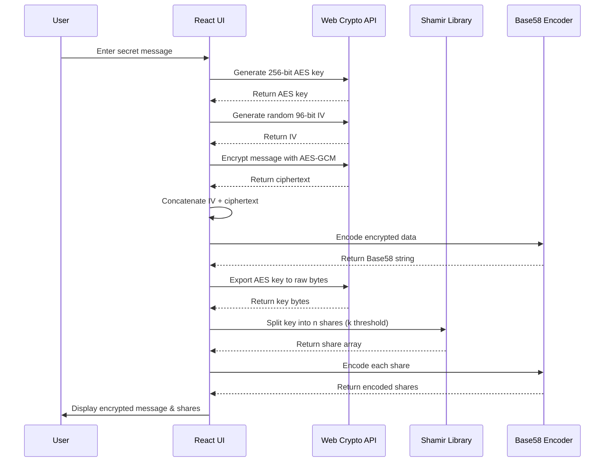
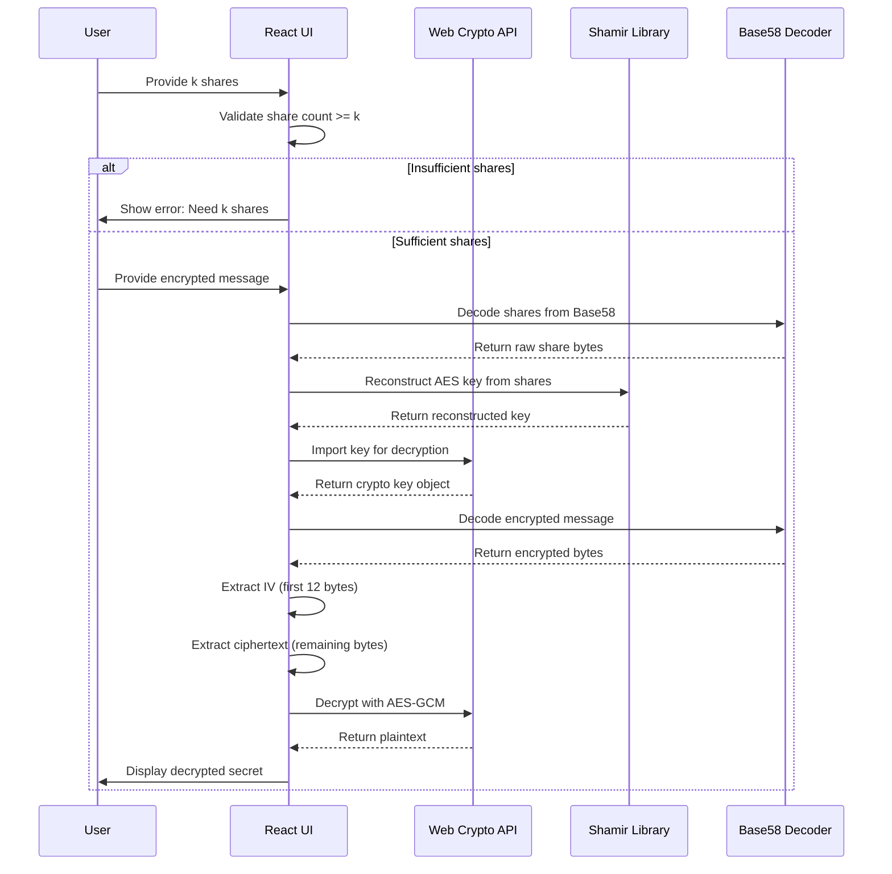

# Shared Secret Encrypt

> 🔐 A secure web application for encrypting and sharing secrets using threshold cryptography

[](https://www.typescriptlang.org/)
[](https://reactjs.org/)
[](https://bun.sh)

## Overview

This application implements a **threshold cryptography** system that allows you to encrypt sensitive information and distribute it among multiple trusted parties. Only when a predetermined number of these parties collaborate can the original secret be recovered.

### 🎯 Use Cases

- **Digital Inheritance**: Share passwords or important information that can only be accessed when multiple family members agree
- **Business Continuity**: Distribute critical access credentials among key team members
- **Legal Escrow**: Create secure arrangements where lawyers or trustees must collaborate
- **Multi-signature Security**: Require consensus before accessing sensitive data

### ⚡ Key Features

- **🔒 AES-GCM Encryption**: Industry-standard encryption with authentication
- **🔀 Shamir's Secret Sharing**: Mathematically proven threshold cryptography
- **🌐 Browser-based**: No server required - runs entirely in your browser
- **🎨 Modern UI**: Clean, intuitive React interface
- **⚡ Fast**: Built with Bun for optimal performance

### ⚠️ Important Security Notice

> **This is currently a proof-of-concept and should NOT be used for real-world sensitive data.** While the cryptographic principles are sound, this implementation lacks additional security measures required for production use, such as secure key management, audit trails, and protection against various attack vectors.

## 📋 Table of Contents

- [Getting Started](#-getting-started)
- [Implementation Details](#implementation-details)
  - [Core Technologies](#core-technologies)
  - [Cryptographic Architecture](#cryptographic-architecture)
  - [Process Flow Diagrams](#process-flow-diagrams)
  - [Security Features](#security-features)
  - [Configuration Options](#configuration-options)
  - [Encoding and Transport](#encoding-and-transport)
  - [Browser Compatibility](#browser-compatibility)
- [Usage Examples](#-usage-examples)
- [Future Enhancements](#future-enhancements)
- [Development](#development)
- [Contributing](#-contributing)
- [License](#-license)

## 🚀 Getting Started

### Prerequisites

- A modern web browser with Web Crypto API support
- [Bun](https://bun.sh) runtime (latest version recommended)

### Quick Start

Currently not deployed, to run locally follow these steps:

```bash
# Clone the repository
git clone https://github.com/antonio-ivanovski/shared-secret-encrypt.git
cd shared-secret-encrypt

# Install dependencies
bun install

# Start development server
bun dev
```

The application will be available at `http://localhost:3000` (or the port shown in your terminal).

## Implementation Details

This application implements a secure secret sharing system using **Shamir's Secret Sharing** algorithm combined with **AES-GCM encryption**. The implementation provides both cryptographic security and usability through a modern React-based interface.

### Core Technologies

| Component | Technology | Purpose |
|-----------|------------|---------|
| **Frontend Framework** | React 19 + TypeScript | Modern, type-safe user interface |
| **Runtime** | Bun | Fast JavaScript runtime and bundler |
| **Encryption** | Web Crypto API (AES-GCM) | Browser-native cryptographic operations |
| **Secret Sharing** | `shamir-secret-sharing` | Threshold cryptography implementation |
| **Encoding** | `bs58` (Base58) | Human-friendly data encoding |

### Cryptographic Architecture

#### 1. Secret Encryption Process

1. **Key Generation**: A 256-bit AES key is generated using `crypto.subtle.generateKey()`
2. **Message Encryption**: The secret message is encrypted using AES-GCM with a random 96-bit IV
3. **Data Packaging**: The IV and ciphertext are concatenated and encoded with Base58
4. **Key Splitting**: The AES key is split into _n_ shares using Shamir's Secret Sharing, where any _k_ shares can reconstruct the original key


#### 2. Secret Decryption Process

1. **Share Collection**: Users provide at least _k_ valid shares (where _k_ is the threshold)
2. **Key Reconstruction**: Shamir's algorithm combines the shares to reconstruct the original AES key
3. **Key Import**: The reconstructed key is imported back into the Web Crypto API
4. **Message Decryption**: The encrypted message is decrypted using the reconstructed key and extracted IV


### Process Flow Diagrams

#### Encryption Sequence



#### Decryption Sequence



### Security Features

| Feature | Implementation | Benefit |
|---------|----------------|---------|
| **🔐 AES-GCM Encryption** | 256-bit keys, 96-bit IV | Confidentiality + authenticity |
| **🔀 Threshold Cryptography** | Shamir's Secret Sharing | Eliminates single points of failure |
| **🎲 Secure Randomness** | `crypto.getRandomValues()` | Cryptographically secure entropy |
| **🧠 Memory Safety** | Browser crypto APIs | Native implementation security |
| **⏱️ Ephemeral Keys** | No persistent storage | Reduces attack surface |

### Configuration Options

The application supports flexible threshold configurations:

| Parameter | Description | Default | Range |
|-----------|-------------|---------|-------|
| **Shares Count** (*n*) | Total number of shares to generate | 3 | 2-10 |
| **Shares Threshold** (*k*) | Minimum shares needed for decryption | 2 | 2-n |

#### Common Configurations

- **2-of-3**: Ideal for couples with a trusted third party
- **3-of-5**: Suitable for families with multiple trusted members  
- **5-of-7**: Good for business or organizational scenarios
- **7-of-10**: High-security scenarios with many stakeholders

### Encoding and Transport

All cryptographic outputs are encoded using Base58, which:

- Avoids similar-looking characters (0, O, I, l)
- Is URL-safe and copy-paste friendly
- Is commonly used in cryptocurrency applications
- Provides good data density compared to Base64

### Browser Compatibility

The application requires modern browsers that support:

- Web Crypto API (`crypto.subtle`)
- ES6+ JavaScript features
- React 19 features

## 💡 Usage Examples

### Basic 2-of-3 Secret Sharing

1. **Configure** the application: Set shares to 3, threshold to 2
2. **Encrypt** your secret: "My bank password is: SecurePass123!"
3. **Distribute** the 3 generated shares to trusted parties:
   - Share 1 → Your spouse
   - Share 2 → Your attorney  
   - Share 3 → Your sibling
4. **Recovery**: Any 2 parties can combine their shares to decrypt your secret

### Digital Will Scenario

```
Configuration: 3-of-5 shares
Secret: "Safe combination: 12-34-56. Bank account: 987654321"

Distribution:
├── Family Member A (Share 1)
├── Family Member B (Share 2)  
├── Attorney (Share 3)
├── Trusted Friend (Share 4)
└── Bank Representative (Share 5)

Recovery: Any 3 parties must collaborate to access the information
```

### Corporate Access Control

```
Configuration: 5-of-7 shares
Secret: "Admin credentials for production server: user=admin, pass=..."

Distribution:
├── CTO (Share 1)
├── Security Lead (Share 2)
├── DevOps Manager (Share 3)
├── Senior Developer A (Share 4)
├── Senior Developer B (Share 5)
├── HR Director (Share 6)
└── CEO (Share 7)

Recovery: Requires 5 out of 7 executives to approve access
```

### Step-by-Step Walkthrough

1. **Open the application** in your browser
2. **Set your threshold** (e.g., 2-of-3, 3-of-5)
3. **Navigate to "Encrypt Secret"** tab
4. **Enter your secret message** in the text area
5. **Click "ENCRYPT"** to generate:
   - An encrypted message (Base58 encoded)
   - Individual shares (also Base58 encoded)
6. **Copy and securely distribute** each share to different parties
7. **Store the encrypted message** safely (can be stored publicly)

To decrypt later:
1. **Navigate to "Decrypt Secret"** tab
2. **Collect the required number of shares** from trusted parties
3. **Enter each share** in the provided fields
4. **Paste the encrypted message**
5. **Click "DECRYPT"** to recover your original secret

## Future Enhancements

### 🔐 Security & Cryptography
- [ ] **Time-locked Secrets**: Implement mechanism to prevent decryption before a certain date or event (death certificates, etc.)
- [ ] **Additional Encryption Algorithms**: Support for ChaCha20-Poly1305 and other modern ciphers
- [ ] **Hardware Security Module**: Integration with HSMs for enterprise deployments
- [ ] **Zero-Knowledge Proofs**: Verify share validity without revealing share content

### 🔄 Share Management
- [ ] **Share Rotation**: Update individual shares without changing the underlying secret
- [ ] **Hierarchical Shares**: Support for weighted shares and complex threshold schemes
- [ ] **Share Expiration**: Time-based share invalidation for enhanced security
- [ ] **Share Backup & Recovery**: Secure mechanisms for share recovery and backup

### 🎯 User Experience
- [ ] **BIP-39 Mnemonic Encoding**: Convert shares to memorable word phrases
- [ ] **QR Code Generation**: Easy share distribution via QR codes
- [ ] **Mobile Progressive Web App**: Full mobile support with offline capabilities
- [ ] **Guided Setup Wizard**: Step-by-step configuration for non-technical users
- [ ] **Share Validation**: Real-time verification of share integrity

### 🔗 Integrations
- [ ] **Crypto Wallet Support**: MetaMask and hardware wallet integration
- [ ] **Cloud Storage**: Secure integration with encrypted cloud storage
- [ ] **Legal Framework**: Integration with digital notary and legal services
- [ ] **Multi-factor Authentication**: Additional authentication layers

## Development

To install dependencies:

```bash
bun install
```

To start a development server:

```bash
bun dev
```

To run for production:

```bash
bun start
```

### Build & Test

```bash
# Build for production
bun build

# Run tests (when available)
bun test

# Type checking
bun run tsc --noEmit
```

This project was created using `bun init` in bun v1.2.18. [Bun](https://bun.sh) is a fast all-in-one JavaScript runtime.

## 🤝 Contributing

We welcome contributions to improve Shared Secret Encrypt! Here's how you can help:

### Getting Started

1. **Fork** the repository
2. **Clone** your fork: `git clone https://github.com/YOUR_USERNAME/shared-secret-encrypt.git`
3. **Create** a feature branch: `git checkout -b feature/amazing-feature`
4. **Install** dependencies: `bun install`
5. **Make** your changes
6. **Test** your changes thoroughly
7. **Commit** your changes: `git commit -m 'Add amazing feature'`
8. **Push** to your branch: `git push origin feature/amazing-feature`
9. **Open** a Pull Request

### Contribution Guidelines

- **Code Quality**: Ensure your code follows TypeScript best practices
- **Testing**: Add tests for new functionality
- **Documentation**: Update README and code comments as needed
- **Security**: Be extra cautious with cryptographic implementations
- **Performance**: Consider performance implications of changes

### Areas for Contribution

- 🐛 **Bug fixes** and security improvements
- 📚 **Documentation** enhancements
- 🎨 **UI/UX** improvements
- 🔐 **Cryptographic** features (with proper review)
- 🧪 **Testing** and quality assurance
- 🌐 **Accessibility** improvements

### Reporting Issues

Found a bug or have a feature request? Please check existing issues first, then create a new issue with:

- Clear description of the problem/feature
- Steps to reproduce (for bugs)
- Expected vs actual behavior
- Browser and system information
- Security considerations (if applicable)

## 📄 License

This project is licensed under the **MIT License** - see the [LICENSE](LICENSE) file for details.

### ⚠️ Security Disclaimer

This software is provided "as is" without warranty of any kind. While we strive for security best practices, this is an experimental project not intended for production use with sensitive data. Users assume all risks associated with using this software.

---

<div align="center">

**Made with ❤️ for the open source community**

[Report Bug](https://github.com/antonio-ivanovski/shared-secret-encrypt/issues) • [Request Feature](https://github.com/antonio-ivanovski/shared-secret-encrypt/issues) • [Contribute](https://github.com/antonio-ivanovski/shared-secret-encrypt/pulls)

</div>
